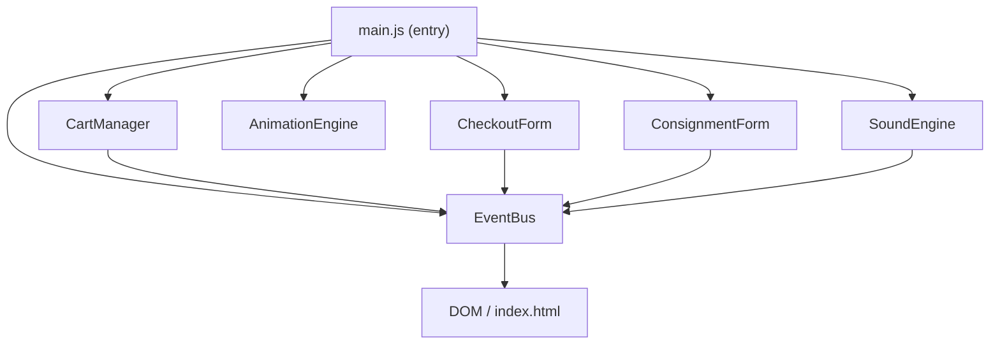
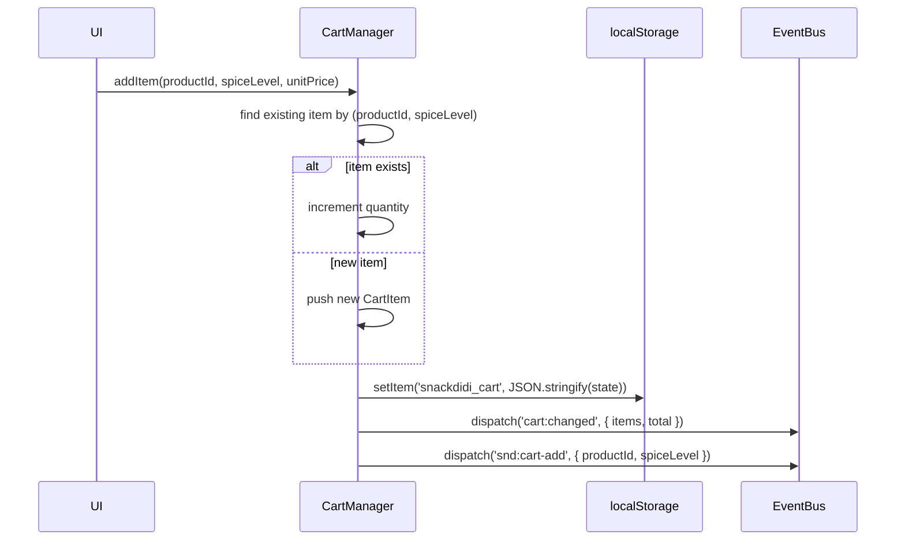

# Design Document

## Snack Didi E-Commerce Website

---

## Overview

Snack Didi is a single-page HTML5 website for a family-owned spicy snack brand. It serves two audiences: retail customers who browse, configure, and purchase products online, and store owners who want to stock products through a consignment arrangement.

The entire front-end stack is **HTML5 + Tailwind CSS (CDN) + Vanilla JavaScript** with no build step and no external framework. This keeps the site lightweight, fully static, and trivially deployable anywhere (GitHub Pages, shared hosting, a simple file server).

The architecture is module-first: each major concern (cart state, sound, animation, checkout, consignment) lives in its own JavaScript module, loaded via `<script type="module">`. Modules communicate through a lightweight custom-event bus rather than direct coupling, which keeps them independently testable.

### Key Design Decisions

| Decision | Rationale |
|---|---|
| Single HTML file (`index.html`) | Simplifies hosting; no routing needed for this scope |
| ES Modules via `<script type="module">` | Native browser support; deferred by default; clean scope isolation |
| Custom-event bus for inter-module comms | Loose coupling; modules don't import each other directly |
| `localStorage` for cart persistence | No server required; survives page refresh |
| Web Audio API over `<audio>` tags | Better latency, clip-restart control, and programmatic mute handling |
| Tailwind Play CDN | Zero build step; fine for this project scale |
| IntersectionObserver for scroll animations | No scroll listeners; better performance; respects `prefers-reduced-motion` |

---

## Architecture

### High-Level Structure

```
index.html
├── <head>
│   ├── Tailwind CSS (cdn.tailwindcss.com)
│   └── Tailwind config block (custom colors, fonts)
└── <body>
    ├── #header           — branding, nav, mute toggle
    ├── #catalog          — product cards (Req 1, 2)
    ├── #delivery-notice  — personal delivery section (Req 5)
    ├── #consignment      — partner section + form (Req 6)
    ├── #cart-drawer      — slide-in cart (mobile) / sidebar (desktop) (Req 3, 4)
    ├── #checkout-modal   — checkout form overlay (Req 4)
    └── <script type="module"> — bootstrap entry point
```

### Module Dependency Graph



### Event Bus Contract

All cross-module communication uses `document.dispatchEvent` / `document.addEventListener` with a namespaced `CustomEvent`:

| Event name | Payload | Producer | Consumer(s) |
|---|---|---|---|
| `snd:cart-add` | `{ productId, spiceLevel }` | CartManager | SoundEngine |
| `snd:spice-select` | `{ productId }` | Catalog UI | SoundEngine |
| `snd:btn-click` | `{}` | Global click handler | SoundEngine |
| `snd:order-confirm` | `{}` | CheckoutForm | SoundEngine |
| `snd:consignment-submit` | `{}` | ConsignmentForm | SoundEngine |
| `cart:changed` | `{ items, total }` | CartManager | Cart UI, CheckoutForm |
| `anim:cart-badge-pulse` | `{}` | CartManager | AnimationEngine |

---

## Components and Interfaces

### 1. CartManager

Manages all cart state. Persists to `localStorage`. Exposes a pure functional API so it can be tested independently of the DOM.

```js
// Public interface
CartManager {
  addItem(productId: string, spiceLevel: string, unitPrice: number): void
  increaseQuantity(productId: string, spiceLevel: string): void
  decreaseQuantity(productId: string, spiceLevel: string): void
  removeItem(productId: string, spiceLevel: string): void
  clearCart(): void
  getState(): CartState          // returns deep clone; never exposes internal ref
  getOrderSummary(): OrderSummary
}
```

**State mutation flow:**



**Cart rendering** is handled by a separate `CartRenderer` (DOM-only, no business logic) that listens to `cart:changed` and rebuilds the cart UI.

### 2. SoundEngine

Manages the Web Audio API lifecycle. The `AudioContext` is **not** created until the first user interaction (`pointerdown` or `keydown`) to comply with browser autoplay policies ([MDN Autoplay Guide](https://developer.mozilla.org/en-US/docs/Web/Media/Guides/Autoplay)).

```js
// Public interface
SoundEngine {
  init(): void                    // registers first-interaction listener
  play(clipName: ClipName): void  // no-op if muted or context not ready
  setMuted(muted: boolean): void
  isMuted(): boolean
}

type ClipName = 'btn-click' | 'spice-select' | 'cart-add' | 'order-confirm' | 'consignment-submit'
```

**Clip restart behavior:** Each clip is stored as an `AudioBuffer`. On `play(clipName)`:
1. If a `BufferSourceNode` for that clip is currently playing, `.stop()` it immediately.
2. Create a fresh `BufferSourceNode`, connect it to `destination`, `.start(0)`.

**Lazy loading:** Audio files are fetched with `fetch()` + `AudioContext.decodeAudioData()` on first play of each clip (not on page load), satisfying Requirement 7.1.

**Mute implementation:** A single `GainNode` (value `0` when muted, `1` when unmuted) sits between all `BufferSourceNode`s and the `destination`. This avoids stopping mid-play; it just silences output instantly.


### 3. AnimationEngine

Handles all scroll-triggered and interaction-triggered animations. Reads `window.matchMedia('(prefers-reduced-motion: reduce)')` once at init and sets a module-level `reducedMotion` boolean; all duration/delay values are gated on this flag.

```js
// Public interface
AnimationEngine {
  init(): void   // sets up IntersectionObserver, attaches hover listeners
}
```

**Scroll entrance animations** use a single `IntersectionObserver` with `threshold: 0.15`. Observed elements carry a `data-animate` attribute. On intersection, the engine adds a CSS class (`animate-in`) that applies `opacity: 1` + `translateY(0)`. Initial state (`opacity: 0; translateY(20px)`) is set inline at DOMContentLoaded, not in a stylesheet, so it degrades gracefully without JS.

**Cart badge pulse** listens to `anim:cart-badge-pulse` and briefly adds a CSS animation class to the cart icon, removing it after 600ms.

**prefers-reduced-motion:** When `reducedMotion` is true, the engine adds the `.motion-safe` Tailwind variant to all transitions/animations, effectively setting them to `duration-0`. No `window.scroll` listeners are ever attached (Requirement 8.5).

### 4. CheckoutForm

Renders and manages the checkout overlay. Validates inputs client-side before showing confirmation.

```js
// Public interface
CheckoutForm {
  open(cartSummary: OrderSummary): void
  close(): void
}
```

**Validation rules:**
- Name: required, max 100 characters
- Phone: required, max 20 characters, pattern `/^[0-9 +\-()\s]{1,20}$/`
- Address: required, max 300 characters

Validation runs on `submit` event. Error messages are injected as `<p role="alert">` elements adjacent to each input (not in a separate error container) so screen readers announce them inline.

**On successful submit:**
1. Renders confirmation message into a dedicated `#order-confirmation` div.
2. Dispatches `snd:order-confirm`.
3. Calls `CartManager.clearCart()`.
4. Closes the form overlay.

### 5. ConsignmentForm

Mirrors CheckoutForm's validation architecture. Fields: owner name, store name, phone, city.

**Validation rules:**
- Owner name: required, max 100 characters
- Store name: required, max 150 characters
- Phone: required, max 20 characters, same pattern as checkout
- City: required, max 100 characters

On successful submit: shows inline confirmation, dispatches `snd:consignment-submit`. The form is NOT cleared post-submit to allow the store owner to reference what they entered.

### 6. Catalog UI (Product Cards)

Each product card is rendered from a static `PRODUCTS` array in `data/products.js`:

```js
const PRODUCTS = [
  { id: 'basreng',       name: 'Basreng',        price: 15000, ... },
  { id: 'kerupuk-seblak', name: 'Kerupuk Seblak', price: 12000, ... },
  { id: 'makaroni-pedas', name: 'Makaroni Pedas',  price: 13000, ... }
]
```

Each card includes:
- Spice level selector (three `<button>` elements with `aria-pressed` toggling)
- Quantity input (optional pre-add config; removed for simplicity — quantity managed in cart)
- "Tambah ke Keranjang" add-to-cart button

**Image fallback:** Each `` has an `onerror` handler that replaces the element with a styled placeholder `<div>` carrying `role="img"` and `aria-label="{productName}"`.

### 7. Responsive Layout

Implemented entirely with Tailwind responsive prefixes. No custom media query CSS is written.

| Element | Mobile (<768px) | Tablet (768px–1023px) | Desktop (≥1024px) |
|---|---|---|---|
| Product grid | `grid-cols-1` | `grid-cols-2` | `grid-cols-3` |
| Cart | Slide-in right drawer (`translate-x-full` → `translate-x-0`) | Inline sidebar (`sticky top-0`) | Fixed right panel |
| Navigation | Hamburger menu (toggle `hidden`) | Full horizontal nav | Full horizontal nav |
| Cart visibility | Toggle button in header | Always visible in layout | Always visible in layout |

---

## Data Models

### CartItem

```ts
interface CartItem {
  productId: string      // e.g. 'basreng'
  productName: string    // display name
  spiceLevel: string     // 'Original' | 'Pedas' | 'Ekstra Pedas'
  quantity: number       // integer ≥ 1
  unitPrice: number      // integer (IDR, no decimals), e.g. 15000
}
```

### CartState

```ts
interface CartState {
  items: CartItem[]
  version: number        // schema version for localStorage migration
}
```

### OrderSummary

```ts
interface OrderSummary {
  items: Array<{
    productName: string
    spiceLevel: string
    quantity: number
    unitPrice: number
    lineTotal: number    // quantity * unitPrice
  }>
  cartTotal: number      // sum of all lineTotals
}
```

### Product

```ts
interface Product {
  id: string
  name: string
  description: string    // max 150 characters
  price: number          // IDR integer
  imageSrc: string
  imageAlt: string
}
```

### CheckoutPayload

```ts
interface CheckoutPayload {
  customerName: string   // max 100 characters
  phone: string          // max 20 characters
  address: string        // max 300 characters
  order: OrderSummary
  submittedAt: string    // ISO timestamp, set client-side
}
```

### ConsignmentPayload

```ts
interface ConsignmentPayload {
  ownerName: string      // max 100 characters
  storeName: string      // max 150 characters
  phone: string          // max 20 characters
  city: string           // max 100 characters
  submittedAt: string
}
```

### localStorage Schema

```
Key: "snackdidi_cart"
Value: JSON.stringify(CartState)

Key: "snackdidi_mute"
Value: "true" | "false"
```

The `version` field in `CartState` allows future schema migrations. If the stored version doesn't match the current expected version, the cart is reset to empty rather than crashing.

---

## Correctness Properties

*A property is a characteristic or behavior that should hold true across all valid executions of a system — essentially, a formal statement about what the system should do. Properties serve as the bridge between human-readable specifications and machine-verifiable correctness guarantees.*

### Property 1: IDR Price Formatting

*For any* positive integer price (in IDR), `formatIDR(price)` shall return a string that matches the pattern `Rp X` where `X` is the number with period-separated thousands groups and no decimal part (e.g., `Rp 15.000`, `Rp 1.250.000`).

**Validates: Requirements 1.2**

---

### Property 2: Cart Add — New Item Creation

*For any* product ID and spice level combination not already present in the cart, calling `CartManager.addItem(productId, spiceLevel, unitPrice)` shall result in the cart containing exactly one new `CartItem` with `quantity === 1`, `productId`, and `spiceLevel` matching the arguments, and the total item count increasing by exactly 1.

**Validates: Requirements 3.1**

---

### Property 3: Cart Add — Deduplication (Increment)

*For any* cart containing a `CartItem` with a given `(productId, spiceLevel)` key, calling `addItem` with the same key shall increment that item's quantity by exactly 1 and shall not change the number of distinct items in the cart.

**Validates: Requirements 3.2**

---

### Property 4: Quantity Lower Bound Invariant

*For any* `CartItem` in the cart with `quantity === 1`, calling `decreaseQuantity` on that item shall leave its quantity at 1 (the quantity is never decremented below 1).

**Validates: Requirements 3.6**

---

### Property 5: Order Summary Arithmetic

*For any* cart state, the `OrderSummary` produced by `getOrderSummary()` shall satisfy: each item's `lineTotal === item.quantity * item.unitPrice`, and `cartTotal === sum of all lineTotals`. No taxes or additional fees are added.

**Validates: Requirements 3.8**

---

### Property 6: Cart Persistence Round-Trip

*For any* cart state (including empty, single-item, and multi-item carts), serializing the state to `localStorage` and then deserializing it (simulating a page reload) shall produce a cart state that is structurally equivalent to the original — same items, same quantities, same spice levels, same unit prices.

**Validates: Requirements 3.10**

---

### Property 7: Checkout Form Validation — Required Field Coverage

*For any* non-empty subset of the three required checkout fields (name, phone, address) left blank on submission, the form shall display a validation message adjacent to each blank field and shall not proceed to the confirmation step.

**Validates: Requirements 4.4**

---

### Property 8: Phone Number Pattern Validation

*For any* string that does not match the allowed phone pattern (`/^[0-9 +\-()\s]{1,20}$/`), submitting a form (checkout or consignment) that contains it in the phone field shall display a phone-field validation message and shall not proceed.

**Validates: Requirements 4.5, 6.5**

---

### Property 9: Checkout Confirmation Content Completeness

*For any* valid checkout submission (name, phone, address, non-empty cart), the confirmation message rendered on screen shall contain the customer's name, each ordered item with its quantity, the cart total, and a statement that the father will personally handle local delivery.

**Validates: Requirements 4.6**

---

### Property 10: Cart Cleared After Checkout

*For any* non-empty cart state, a successful checkout form submission shall result in the cart containing zero items and the displayed cart total being `Rp 0`.

**Validates: Requirements 4.8**

---

### Property 11: Consignment Form Validation — Required Field Coverage

*For any* non-empty subset of the four required consignment fields (owner name, store name, phone, city) left blank on submission, the form shall display a validation message adjacent to each blank field and shall not submit.

**Validates: Requirements 6.4**

---

### Property 12: Mute Suppresses All Audio

*For any* trigger event dispatched while `SoundEngine.isMuted() === true`, the engine shall not invoke playback on any `BufferSourceNode` (i.e., no audio clip is started).

**Validates: Requirements 7.5**

---

## Error Handling

### Image Load Failures (Req 1.3)

Each product `` registers an `onerror` handler at render time. On failure, the handler:
1. Replaces the `` with a `<div role="img" aria-label="{productName}">` placeholder styled with a warm-colored background and the product name as visible text.
2. Does not throw; the rest of the page renders normally.

### localStorage Unavailable or Corrupted (Req 3.10)

`CartManager.load()` wraps `localStorage.getItem` in a try/catch. If the stored JSON is malformed or the key is missing, it silently initializes an empty cart. A schema version mismatch also resets to empty.

### AudioContext Suspended (Req 7.6)

`SoundEngine.play()` checks `AudioContext.state`. If it is `'suspended'`, it calls `context.resume()` and waits for the Promise to resolve before starting playback. If `resume()` fails (rare, can happen in some private-browsing modes), the play call is silently swallowed — sound is a progressive enhancement.

### Form Submission Errors

Both forms operate entirely client-side; there is no network submission. Validation errors are purely presentational. Error messages use `role="alert"` so screen readers announce them without requiring focus management.

### Checkout on Empty Cart (Req 4.2)

Before opening the checkout overlay, `CheckoutForm.open()` receives the `OrderSummary`. If `cartTotal === 0` and `items.length === 0`, it displays an inline error message near the checkout button instead of opening the form.

---

## Testing Strategy

The testing stack for a no-build Vanilla JS project is:

- **Unit / property tests**: [Vitest](https://vitest.dev/) (ESM-native, zero config, fast)
- **Property-based testing**: [fast-check](https://fast-check.dev/) — well-maintained, works in Vitest, extensive arbitrary generators
- **DOM tests**: [jsdom](https://github.com/jsdom/jsdom) (bundled with Vitest's `jsdom` environment)
- **Integration / responsive**: Manual browser testing at 320px, 768px, 1024px, 1920px

### Unit Tests

Unit tests cover specific examples, edge cases, and integration points:

- `formatIDR(15000)` → `"Rp 15.000"`
- Spice level selector: clicking one deselects others
- Cart empty state renders correct message
- Hamburger menu toggles nav visibility
- Image `onerror` handler inserts placeholder with correct `aria-label`
- Mute toggle persists state to `localStorage`
- SoundEngine defers AudioContext creation until first user gesture
- Clip restart: calling `play()` on an in-progress clip stops it and starts fresh

### Property-Based Tests

Each property in the Correctness Properties section maps to exactly one fast-check property test. Minimum 100 runs per property.

```
Feature: snack-didi-ecommerce, Property 1: IDR price formatting
Feature: snack-didi-ecommerce, Property 2: Cart add — new item creation
Feature: snack-didi-ecommerce, Property 3: Cart add — deduplication
Feature: snack-didi-ecommerce, Property 4: Quantity lower bound invariant
Feature: snack-didi-ecommerce, Property 5: Order summary arithmetic
Feature: snack-didi-ecommerce, Property 6: Cart persistence round-trip
Feature: snack-didi-ecommerce, Property 7: Checkout form validation
Feature: snack-didi-ecommerce, Property 8: Phone number pattern validation
Feature: snack-didi-ecommerce, Property 9: Checkout confirmation content
Feature: snack-didi-ecommerce, Property 10: Cart cleared after checkout
Feature: snack-didi-ecommerce, Property 11: Consignment form validation
Feature: snack-didi-ecommerce, Property 12: Mute suppresses audio
```

**Example property test (Property 5):**

```js
// Feature: snack-didi-ecommerce, Property 5: Order summary arithmetic
import fc from 'fast-check'
import { CartManager } from '../src/CartManager.js'

test('order summary arithmetic holds for any cart state', () => {
  fc.assert(
    fc.property(
      fc.array(
        fc.record({
          productId: fc.constantFrom('basreng', 'kerupuk-seblak', 'makaroni-pedas'),
          spiceLevel: fc.constantFrom('Original', 'Pedas', 'Ekstra Pedas'),
          quantity: fc.integer({ min: 1, max: 99 }),
          unitPrice: fc.integer({ min: 1000, max: 100000 }),
        }),
        { minLength: 1, maxLength: 10 }
      ),
      (items) => {
        const cart = CartManager.fromItems(items)
        const summary = cart.getOrderSummary()
        const expectedTotal = items.reduce((acc, i) => acc + i.quantity * i.unitPrice, 0)
        const allLineTotalsCorrect = summary.items.every(
          (s, idx) => s.lineTotal === items[idx].quantity * items[idx].unitPrice
        )
        return allLineTotalsCorrect && summary.cartTotal === expectedTotal
      }
    ),
    { numRuns: 200 }
  )
})
```

**Example property test (Property 6 — round-trip):**

```js
// Feature: snack-didi-ecommerce, Property 6: Cart persistence round-trip
test('cart state survives localStorage serialization round-trip', () => {
  fc.assert(
    fc.property(
      fc.array(/* CartItem arbitrary */),
      (items) => {
        const original = CartManager.fromItems(items)
        original.saveToStorage(mockStorage)
        const restored = CartManager.loadFromStorage(mockStorage)
        return JSON.stringify(original.getState().items) ===
               JSON.stringify(restored.getState().items)
      }
    ),
    { numRuns: 200 }
  )
})
```

### Dual Testing Philosophy

- **Property tests** handle input variation and catch edge cases across the full input space (any price, any cart contents, any combination of blank fields).
- **Unit tests** handle concrete examples, integration points (SoundEngine ↔ EventBus), and behaviors not expressible as pure input/output properties (DOM state, animation class application).
- Together they provide comprehensive coverage without duplicating effort.
